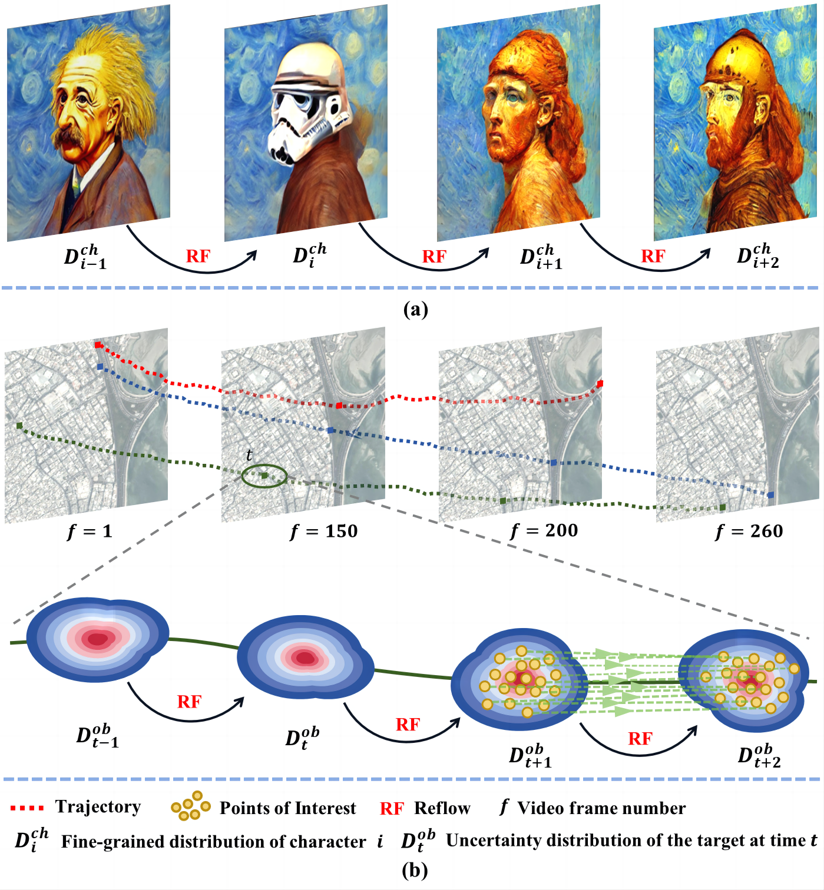
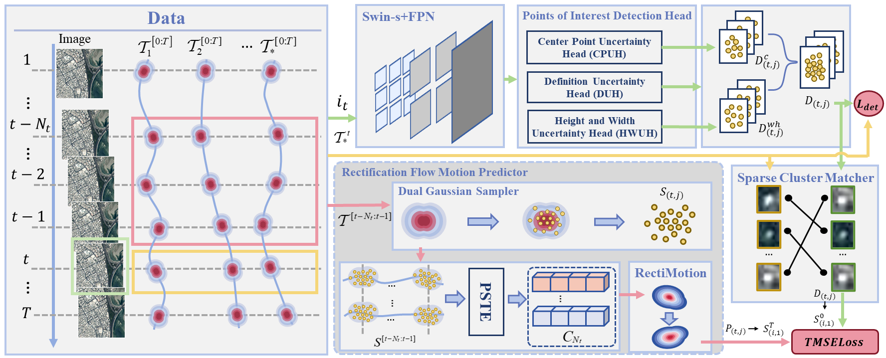
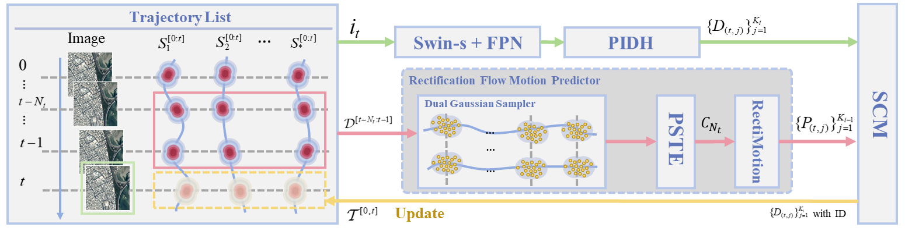
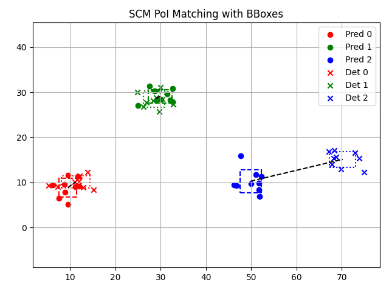

# PIFTrack

Official implementation of **PIFTrack**, a novel framework for multi-object tracking in satellite videos via Points-of-Interest (PoIs) based flow modeling and association.

  <figure>
    
    <figcaption><b>Figure 1</b>: Nonlinear motion prediction based on diffusion ODE.</figcaption>
  </figure>

---

## 📰 News

📌 **June 2025**: The manuscript has been submitted to **IEEE Transactions on Geoscience and Remote Sensing (TGRS)**. More details and models will be released upon acceptance. Stay tuned!

---

## 🔍 Introduction

PIFTrack tackles the unique challenges of multi-object tracking (MOT) in satellite videos, such as ambiguous annotations, nonlinear motion, and degraded IoU-based association. To address these issues, PIFTrack introduces:
<!-- - **PIDH Module**: Probabilistic modeling of spatial ambiguity using Points-of-Interest (PoIs).
- **RFMP Module**: Trajectory prediction via Residual Flow-guided Motion Prior, modeling nonlinear dynamics without handcrafted assumptions.
- **SCM Strategy**: An IoU-free association strategy for robust tracking of tiny targets. -->

  <figure>
    
    <figcaption><b>Figure 2(a)</b>: The training pipeline of PIFTrack.</figcaption>
  </figure>
  
  <figure>
    
    <figcaption><b>Figure 2(b)</b>: The inference pipeline of PIFTrack.</figcaption>
  </figure>

---

<!-- ## 🧠 Network Architecture

The architecture of PIFTrack consists of two stages:
1. **Training Stage**: Learns PoI-based representations and motion flows using PIDH and RFMP modules.
2. **Inference Stage**: Applies SCM for effective association, ensuring trajectory continuity under challenging motion and appearance variations.

  

--- -->

## 🔗 Sparse Cluster Matcher (SCM) Example

The following visualization demonstrates the effectiveness of SCM in associating tiny objects across frames using PoI overlaps, instead of unstable IoU or center distance metrics.

  

---

## 🛠️ Engineering Notes

- The **detection** component of PIFTrack is developed based on the [MMDetection](https://github.com/open-mmlab/mmdetection) framework.
- We sincerely thank the **OpenMMLab** team for providing such a powerful detection toolkit.
